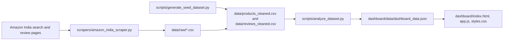

# Architecture

## Layers

1. Collection

   `scrapers/amazon_india_scraper.py` uses Playwright to collect public listing and review fields. It writes raw CSV files so the extraction step is auditable.

2. Cleaning

   `scripts/generate_seed_dataset.py` creates the deterministic cleaned dataset used for immediate evaluation. In a live run, this layer should be replaced or extended with a normalizer that converts raw Amazon text into the same schema.

3. Analysis

   `scripts/analyze_dataset.py` computes brand benchmarks, product summaries, aspect sentiment, recurring themes, value-for-money scores, anomalies, and agent insights.

4. Presentation

   The dashboard is a static browser app. All charts, filters, sorting, and drilldowns are client-side, which makes the submission simple to run and review.

## Decision-Maker Flow

1. Start with the overview to understand coverage and average market signals.
2. Use filters to isolate brand, category, rating, price ceiling, or sentiment band.
3. Compare brands by price, discount, rating, review count, sentiment, and value score.
4. Drill into products to see the exact praise, complaints, and aspect-level sentiment.
5. Use Agent Insights to identify actions: defend premium pricing, reduce discount dependence, fix durability issues, or lean into value positioning.
