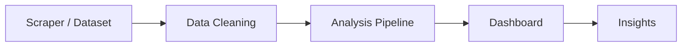

<h1 align="center">🧠 Competitive Intelligence Dashboard</h1>
<h3 align="center">⚡ AI-Powered Market Analysis for Luggage Brands (Amazon India)</h3>

<p align="center">
  
  
  
  
</p>

<p align="center">
  <b>🔍 Analyze • 📊 Compare • 💡 Discover Insights</b>
</p>

---

## 🧠 What is this?

> An **interactive competitive intelligence system** that analyzes Amazon India luggage brands using  
> **sentiment analysis, pricing data, and customer feedback**.

👉 Built to answer real business questions like:
- Which brands are premium vs budget?
- Who wins on value-for-money?
- What do customers actually complain about?

---

## ⚙️ System Flow  



---

## 📊 Dashboard Capabilities  

### 🔍 Market Positioning
- Compare brands by **price, rating, sentiment**
- Identify **premium vs value brands**

---

### 💰 Pricing Intelligence
- Average price per brand  
- Discount analysis  
- Price bands (mass vs premium)

---

### 💬 Customer Insights
- Positive & negative themes  
- Aspect-level sentiment (8 categories)  
- Complaint patterns  

---

### 📈 Competitive Analysis
- Side-by-side brand comparison  
- Value-for-money scoring  
- Market positioning clarity  

---

### 🚨 Smart Insights (AI-style)
- Auto-generated conclusions  
- Detects non-obvious patterns  
- Flags anomalies  

---

## 📊 Dataset Overview  

- 🏷️ **6 brands**  
- 📦 **60 products**  
- 💬 **360+ reviews**  

Brands:
```
Safari, Skybags, American Tourister, VIP, Aristocrat, Nasher Miles
```

---

## 🚀 Quick Start  

```bash
# Generate dataset
python scripts/generate_seed_dataset.py

# Run analysis
python scripts/analyze_dataset.py

# Start dashboard
python -m http.server 8080 -d dashboard
```

👉 Open: `http://localhost:8080`

---

## 🧪 Example Insights  

- 📈 Aristocrat leads in sentiment without being cheapest  
- 💰 American Tourister dominates premium pricing  
- ⚠️ Some high-rated products still show durability complaints  
- 🏆 Skybags offers best value-for-money  

---

## 🛠️ Tech Stack  

| Layer | Tech |
|------|------|
| Data Processing | Python |
| Analysis | Pandas + custom logic |
| Dashboard | HTML/CSS/JS |
| Visualization | Charts + tables |

---

## 🎯 Key Features  

✔ Sentiment scoring (-1 to 1)  
✔ Theme extraction (pros & cons)  
✔ Aspect-level analysis  
✔ Anomaly detection  
✔ Value scoring  
✔ Interactive filters  

---

## 🔥 What Makes This Strong  

Most dashboards:
❌ Just show data  

This system:
✅ Generates **actionable insights**

---

## 🔮 Future Improvements  

🚀 Live scraping automation  
🧠 LLM-based sentiment analysis  
📊 Advanced charts  
🌐 Deploy as web app  

---

## 💡 Philosophy  

> “Data becomes powerful when it answers real decisions.”

---

<p align="center">
  📊 Built for real-world competitive intelligence
</p>
